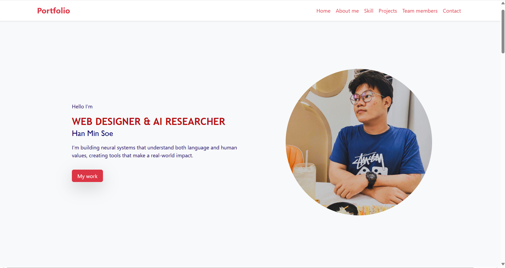

# Bootstrap Portfolio Project

  
*Live Demo: [GitHub Pages Link](https://github.com/Hanmsoe17/Portfolio.git)*  

A responsive portfolio website built with **Bootstrap 5** as part of my frontend training. Focuses on core Bootstrap components, grid system, and utilities.

## ✨ Key Features  
- **100% Bootstrap**
- **Mobile-First**: Fully responsive layout  
- **Bootstrap Components**:  
  - Navbar with dropdown  
  - Card-based project gallery  
  - Modal for contact form  
  - Offcanvas sidebar (optional)  
- **Utilities**: Spacing, shadows, typography classes  

## 🛠 Tech Stack  
- **Frontend**: HTML5, Bootstrap 5  
- **Deployment**: GitHub Pages  
- **IDE**: VS Code  

## 🚀 How to Run  
1. Clone the repo:  
   ```bash
   git clone https://github.com/Hanmsoe17/Portfolio.git
